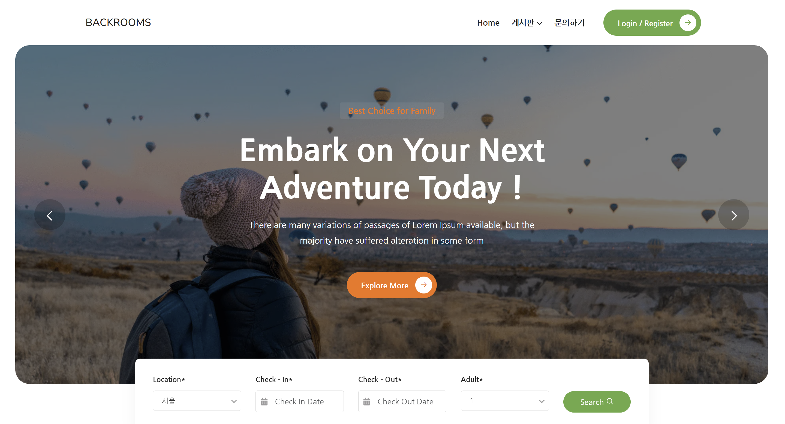
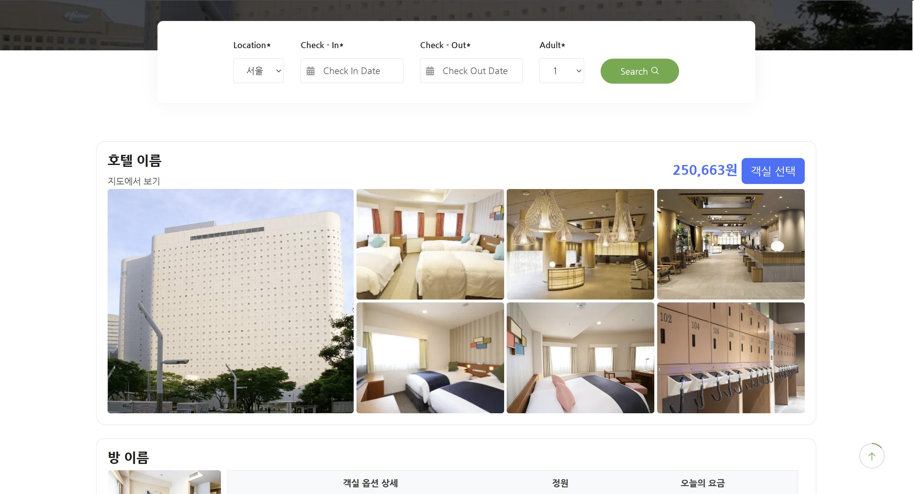
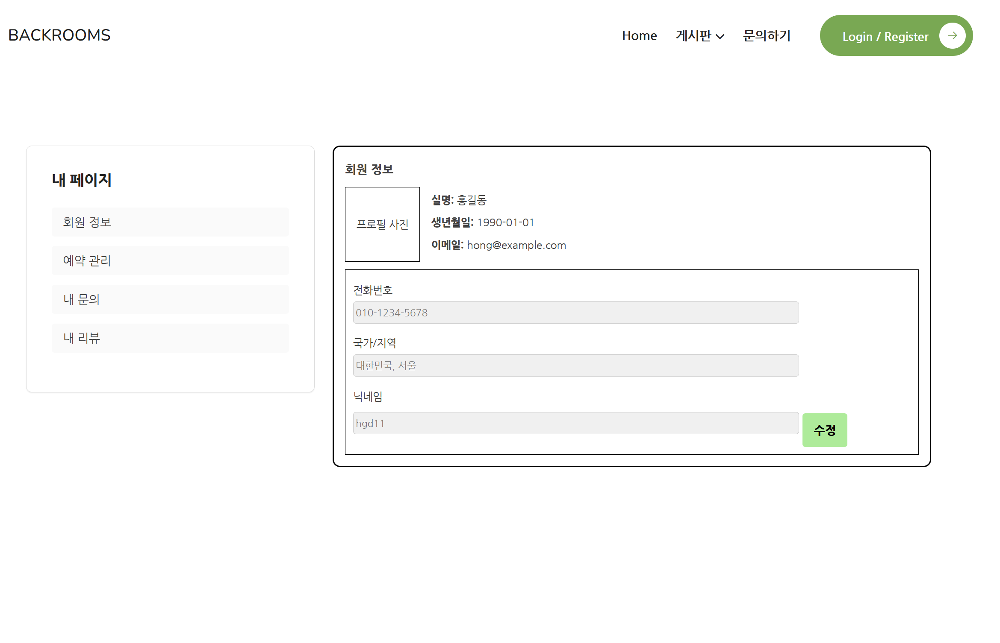
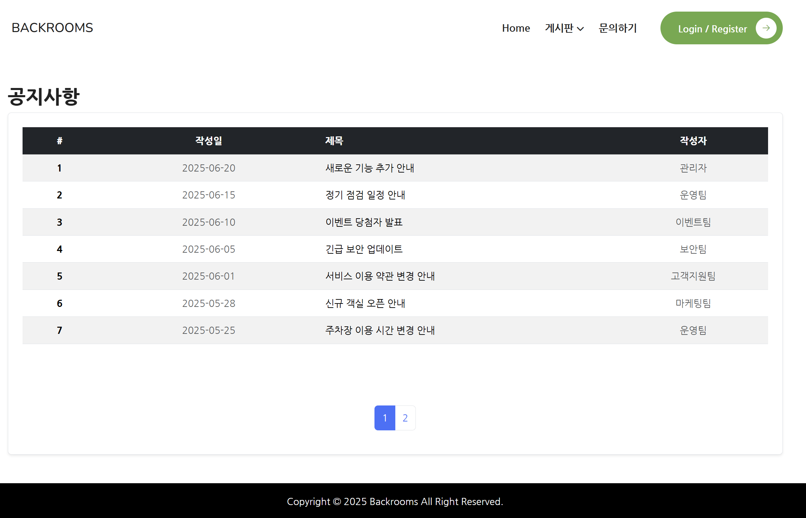

# 🏨 Backrooms

Backrooms는 호텔 예약 사이트로 사용자가 원하는 호텔을 검색하고, 객실을 예약할 수 있는 웹 애플리케이션입니다.

## 목차
- [개요](#개요)
- [페이지 구성](#페이지-구성)

## 개요
- **프로젝트 이름**: Backrooms
- **개발 언어 및 기술**: HTML, CSS(Bootstrap), Javascript

## 페이지 구성
|||
|:---:|:---:|
|메인 페이지|호텔 정보 페이지|
|||
|문의 게시판|마이 페이지|